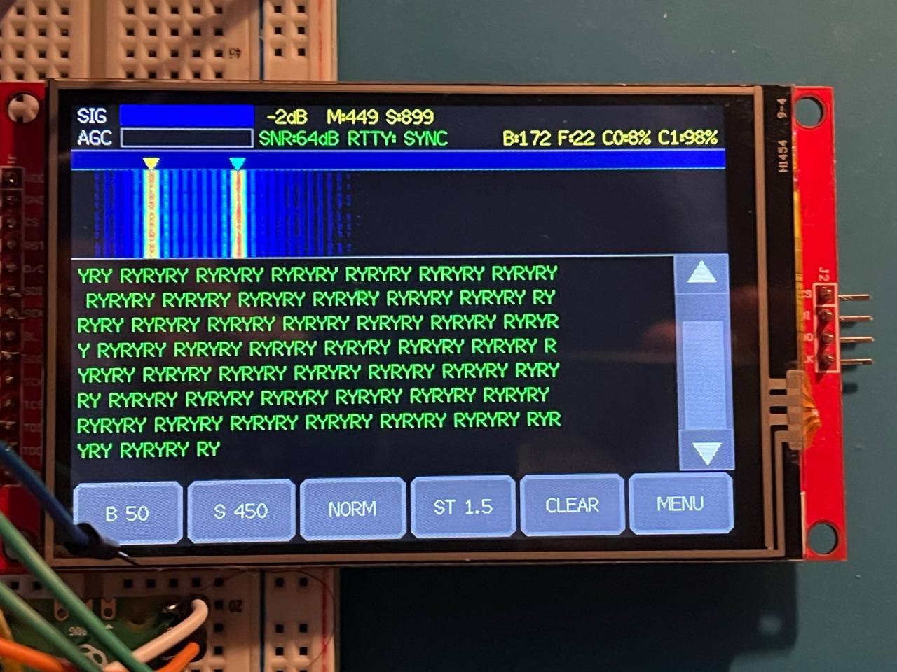
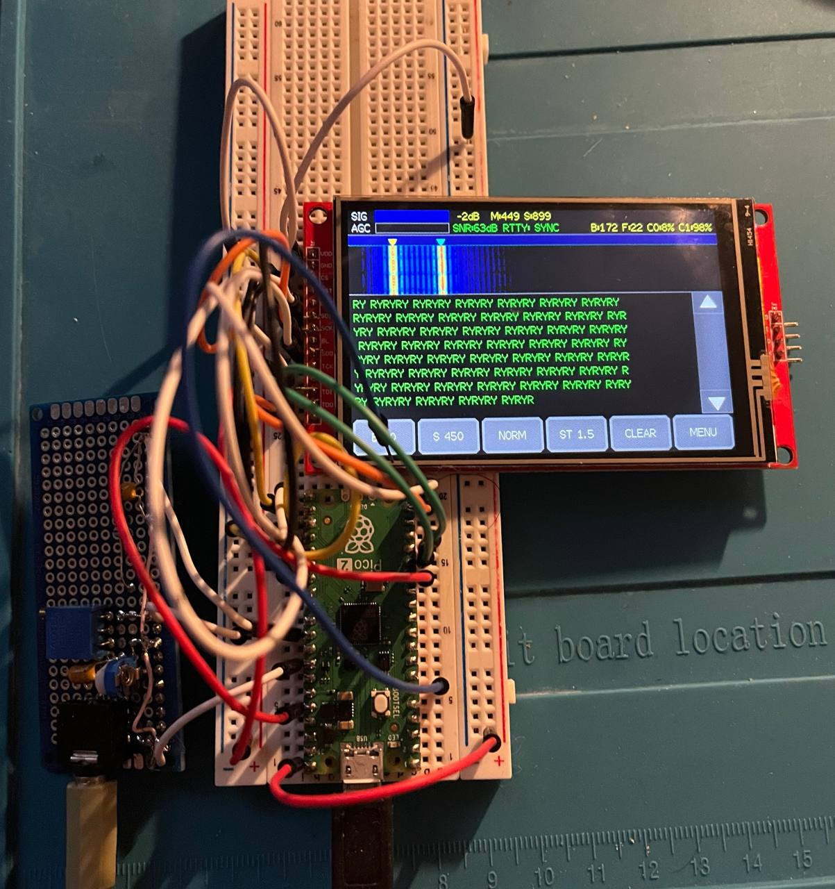
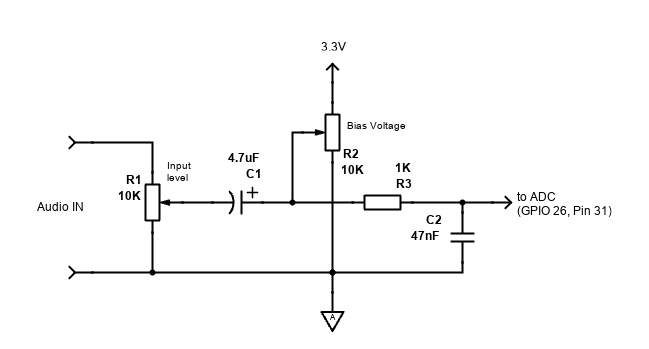

# TouchRTTY (RP2350 / Raspberry Pi Pico 2)
**Professional-grade Radioteletype (RTTY) Decoder exclusively for the RP2350 microcontroller.**

<p align="center">
  
  
</p>

This project implements a high-performance, software-defined radio (SDR) style RTTY decoder on the **dual-core RP2350 (ARM Cortex-M33)**. It utilizes the advanced DSP capabilities of the RP2350 to achieve highly stable reception even under severe selective fading and noise.

> [!IMPORTANT]
> **Hardware Requirement:** This project is specifically designed for the **Raspberry Pi Pico 2 (RP2350)**. It will NOT run on the original RP2040 due to higher memory and DSP requirements.

## Key Features (Build 194)

*   **RP2350 Dual-Core Optimization:**
    *   **Core 0 (DSP Engine):** Dedicated to hard-real-time audio processing at 10,000 Hz via hardware ADC FIFO. Strict `float` policy with FPU acceleration. Core load ~7%.
    *   **Core 1 (UI & FFT):** Handles 1024-point FFT, ILI9488 TFT display via 60MHz PIO DMA, touch input, and serial commands. ~20 FPS waterfall rendering.
*   **Professional DSP Pipeline:**
    *   63-Tap FIR Bandpass Filter
    *   Quadrature (I/Q) Demodulator with Biquad LPF (Extended Raised Cosine)
    *   Automatic Threshold Correction (ATC) with FASR envelope detectors
    *   Digital Phase-Locked Loop (DPLL) with PI controller — continuous reception of 1.0 stop-bit streams
    *   Automatic Frequency Control (AFC) — FFT-based peak detection, ±100Hz tracking
    *   Digital AGC with fast attack / slow release
    *   SNR-based squelch with hysteresis
*   **Tuning Lab:**
    *   Eye diagram with phosphor persistence (DPLL-synchronized, zero jitter)
    *   Real-time parameter adjustment (ALPHA, BW, SQ) via touch or serial commands
    *   Error rate indicator (100-char sliding window)
*   **Top Panel:** 3 thin bars — SIG (signal level dB), AGC (gain dB), ERR (error rate %)
*   **Display Modes:** Waterfall, Spectrum, Lissajous (XY) scope
*   **ILI9488 Compatibility:** Native Mode 11 (BGR, 16-bit endian swapped) rendering via RGB565

## Development Roadmap

*   **PHASE 4:** SD-Card Integration (exFAT) & Data Logging.
*   **PHASE 5:** CW (Morse Code) Decoder & APF Filter.
*   **PHASE 6:** FT8 / FT4 Mode Implementation.
*   **PHASE 7:** WEFAX Decoder (HF Weather Fax).

## WebSDR / Real-World Testing Guide

You can test this decoder with real over-the-air signals using a WebSDR (like the University of Twente WebSDR).

### Setup
1.  Open a WebSDR in your browser.
2.  Tune to a known RTTY frequency (e.g., German Weather Service DWD on `10100.8 kHz`).
3.  Set the WebSDR modulation to **USB** (Upper Sideband).
    *   *Note: DWD transmits in F1B/LSB. If you tune in USB, you must press `INV` on the Pico's screen to swap Mark/Space, OR tune the WebSDR to LSB and leave the Pico in Normal mode.*
4.  Connect your PC's headphone output using the audio adapter (see below) to the Pico's ADC input (GPIO 26).
    *   *Ensure your audio level is correct. Watch the `SIG` bar on the screen; it should peak around `-15 dB` to `-5 dB` without triggering clipping.*

### Tuning on the Pico
1.  **DWD SYNOP (Weather):** B 50, S 450, ST 1.5
2.  **Amateur Radio (Ham):** B 45, S 170, ST 1.5
3.  Tap the Waterfall to place the yellow/cyan markers over the two visible peaks.
4.  Text will begin printing on the screen when signal is detected.

## Hardware Wiring Guide

### Display (ILI9488) - SPI0
| Display Pin | Pico GPIO | Physical Pin | Function |
| :--- | :--- | :--- | :--- |
| **VCC** | - | Pin 36 | 3.3V Power (3V3_OUT) |
| **GND** | - | Pin 38 | Ground (GND) |
| **CS**  | GP17 | Pin 22 | LCD Chip Select |
| **RESET**| GP21 | Pin 27 | Hardware Reset |
| **DC/RS**| GP20 | Pin 26 | Data / Command |
| **SDI (MOSI)**| GP19 | Pin 25 | SPI Data In |
| **SCK** | GP18 | Pin 24 | SPI Clock (60 MHz) |
| **SDO (MISO)**| GP16 | Pin 21 | Define in code, physically disconnect to reduce bus noise |
| **LED** | - | Pin 36 | Backlight Power (3V3_OUT) |

### Touch Controller (XPT2046) - SPI1
| Touch Pin | Pico GPIO | Physical Pin | Function |
| :--- | :--- | :--- | :--- |
| **T_CLK** | GP10 | Pin 14 | SPI Clock (2.5 MHz) |
| **T_CS**  | GP15 | Pin 20 | Touch Chip Select |
| **T_DIN** | GP11 | Pin 15 | SPI TX (MOSI) |
| **T_DO**  | GP12 | Pin 16 | SPI RX (MISO) |
| **T_IRQ** | GP14 | Pin 19 | Interrupt (Boot Calibration) |

### Audio Input
| Component | Pico GPIO | Physical Pin | Function |
| :--- | :--- | :--- | :--- |
| **Audio Signal** | GP26 | Pin 31 | ADC0 (Biased Audio Input) |
| **Audio Ground** | - | Pin 33 | Analog Ground (AGND) |

### Rotary Encoder
| Encoder Pin | Pico GPIO | Physical Pin | Function |
| :--- | :--- | :--- | :--- |
| **SW (Switch)** | GP4 | Pin 6 | Push Button to GND (see Boot Actions below) |
| **CLK / A** | *TBD* | - | *Reserved for future use* |
| **DT / B**  | *TBD* | - | *Reserved for future use* |
| **GND** | - | Any GND | Ground |

**Boot Actions (Encoder SW):**
- **Short press** at boot: Touch screen recalibration only (LED blinks, release when ready)
- **Hold 3 seconds** at boot: Full factory reset (wipes calibration + all settings) + recalibration

### SD Card Module - SPI1 (Future)
| SD Card Pin | Pico GPIO | Physical Pin | Function |
| :--- | :--- | :--- | :--- |
| **MOSI / CMD** | GP11 | Pin 15 | SPI1 TX (Shared with Touch T_DIN) |
| **MISO / D0**  | GP12 | Pin 16 | SPI1 RX (Shared with Touch T_DO) |
| **SCK / CLK**  | GP10 | Pin 14 | SPI1 Clock (Shared with Touch T_CLK) |
| **CS / DAT3**  | GP13 | Pin 17 | Dedicated SD Chip Select |
| **VCC** | - | Pin 36 or 40 | 3.3V or 5V (Depends on your SD module) |
| **GND** | - | Any GND | Ground |

## Hardware Audio Input Adapter
To safely feed audio from a PC, radio, or WebSDR into the RP2350's ADC, a DC-biasing circuit is required. The Pico's ADC reads voltages between **0V and 3.3V**.

**Required Circuit:**



1. **R1 (Input Level):** 10k potentiometer to adjust audio volume.
2. **C1 (DC Blocking):** 4.7uF capacitor to block DC offset.
3. **R2 (Bias Voltage):** 10k trimpot between 3.3V and AGND, set to **1.65V**.
4. **R3 + C2 (Low-Pass Filter):** 1k + 47nF RC anti-alias filter.

*Connect all grounds to **AGND (Pin 33)**. Connect output to **GPIO 26 (Pin 31)**.*

## USB Serial Interface

Connect via USB to a terminal. When DIAG mode is OFF, serial outputs decoded RTTY text. When DIAG is ON (via `DIAG ON` command or DUMP button), outputs diagnostic stream every ~500ms:

```
[D] SNR=15.3 SIG=-28.5 ERR=12% SQ=OPEN AGC=+13dB PH=0.45 FE=0.002 M=0.234 S=0.198 A=0.050 K=1.00 SQT=8.0 F=1535 B=45 C0=7% C1=30%
```

### Serial Commands (send with Enter)

| Command | Description |
| :--- | :--- |
| `ALPHA <0.005-0.200>` | DPLL loop bandwidth |
| `BW <0.3-2.0>` | LPF filter bandwidth (K) |
| `SQ <dB>` | Squelch SNR threshold |
| `FREQ <Hz>` | Center frequency |
| `BAUD <0-2>` | 0=45, 1=50, 2=75 baud |
| `SHIFT <0-4>` | 170/200/425/450/850 Hz |
| `STOP <0-2>` | 1.0/1.5/2.0 stop bits |
| `INV ON\|OFF` | Mark/Space inversion |
| `AFC ON\|OFF` | Auto frequency control |
| `AGC ON\|OFF` | Auto gain control |
| `DIAG ON\|OFF` | Diagnostic stream toggle |
| `STATUS` | Print all current parameters |
| `SAVE` | Save settings to flash |
| `CLEAR` | Reset DSP state |
| `HELP` | List all commands |

## Release History

*   **Build 194** (2026-04-04): Tuning Lab, eye diagram, serial command system, menu restructure.
*   **Build 191** (2026-04-04): Error rate indicator, 3-bar top panel, reception fix.
*   **Build 189** (2026-04-02): Hardware FPU acceleration, strict float policy.
*   **[v1.72](https://github.com/Alex-Electron/TouchRTTY/releases/tag/v1.72)** (2026-03-31): Phase 3 Final. Professional DSP demodulator.

## Build Instructions
Compiled via the Raspberry Pi Pico SDK (v2.2.0+) and CMake.

```bash
mkdir build && cd build
cmake -G Ninja ..
ninja
picotool load TouchRTTY.uf2 -f
```
