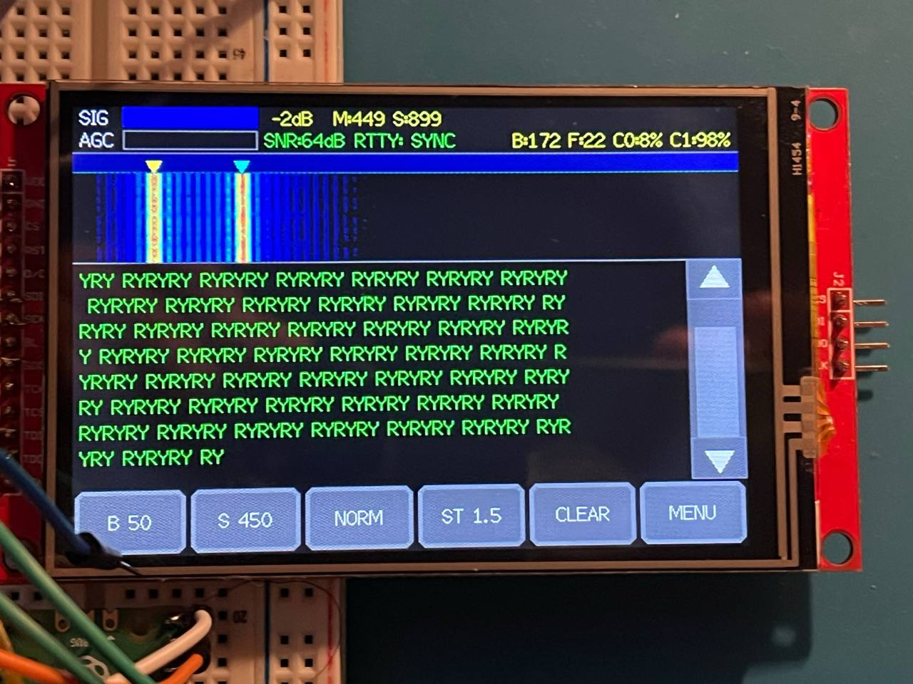
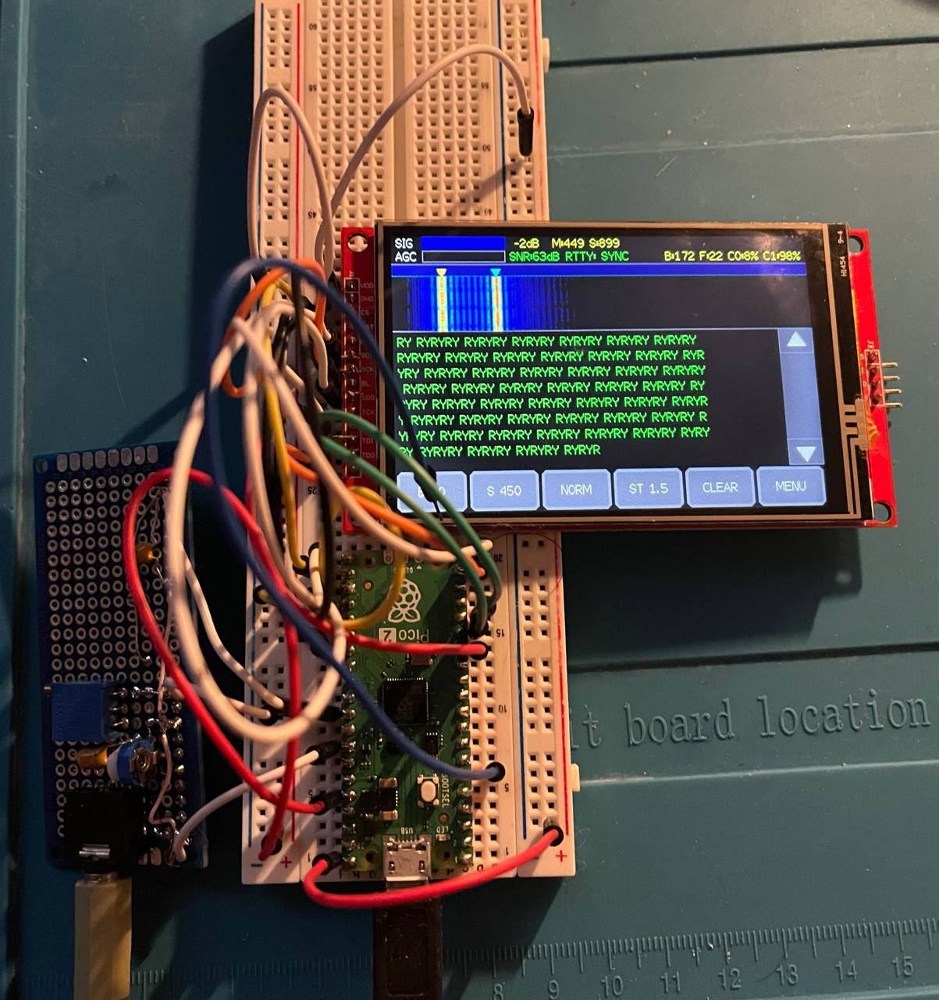

# TouchRTTY

> 🇷🇺 [Читать на русском](README.ru.md)

A pocket-sized RTTY decoder you can actually trust on weak signals.

<p align="center">
  
  
</p>

This is a Raspberry Pi Pico 2 (RP2350) running a from-scratch SDR-style
demodulator and a small neural net that kicks in when the signal gets
ugly. On the same audio where 2Tone collapses into random letters, you
still get readable telegraphy. I benched it. The numbers below are real.

> [!IMPORTANT]
> You need the **Pico 2 (RP2350)** — not the original RP2040. I lean on
> the M33's FPU and need more SRAM than the older chip has. Save yourself
> the headache.

---

## Where I are right now

The latest release is **v2.0.0** (firmware build B265, NN weights v13).
If you flash nothing else and just want the best decoder I've shipped,
grab [`TouchRTTY_v2.0.0.uf2`](TouchRTTY_v2.0.0.uf2) from the repo root.

Full release notes: [`RELEASE_v2.0.0.md`](RELEASE_v2.0.0.md).

What's interesting about this build:

* **NN actually helps now.** Earlier versions of the NN were a wash —
  better at threshold, worse at comfortable signal levels. v13 fixed
  that. NN-ON is at least as good as NN-OFF at every SNR I tested, and
  much better below −14 dB.
* **You can see what the NN is thinking.** New serial command
  `DUMP FRAMES ON` streams every Baudot frame's seven soft-bit values
  plus the hard-decision label. Drop a WAV through the decoder, capture
  the stream, and you have labeled training data — the same loop I used
  to build v13.
* **The UI got simpler.** NOTCH and VIT are now toggles right in the
  main menu instead of being buried in a popup, and frame-rejection
  errors show up as a single red `*` in the on-screen text instead of
  the full `[ERR]` token. Cleaner reading.

Full release notes live in [`CHANGELOG_B265.md`](CHANGELOG_B265.md).

---

## How it stacks up against 2Tone

I benchmarked against [2Tone 26.01a](http://www.tonemap.com/Software.html)
(David G3YYD's well-regarded decoder), averaged over three random seeds,
sweeping SNR from −4 to −22 dB in 2 dB steps with 30 seconds of dwell
per bin. Same audio fed into both decoders through the same Voicemeeter
loopback.

| SNR | TouchRTTY NN-OFF | TouchRTTY NN-ON (v13) | What 2Tone does there |
|---:|---:|---:|---|
| −12 | 16.2 % | **15.5 %** | Starts breaking; ~22 pp real errors |
| −14 | 32.2 % | **23.4 %** (σ 1.5) | Mostly noise |
| −16 | 77.7 % | **55.3 %** (σ 3.2) | ~58 pp real errors — random letters |
| −20 | 88.2 % | **80.4 %** (σ 2.3) | Long dead |

Anything ≤ 14 % on TouchRTTY is mostly cer_analyze's cyclic-rotation
artifact — the actual decoded text reads clean. Below the artifact
baseline, **TouchRTTY produces readable telegraphy at SNR levels where
2Tone's output is random gibberish.** The honest reference run lives at
[`datasets/logs/bench_auto_v2/`](datasets/logs/bench_auto_v2/) (commit
`af4bdd0`).

The low standard deviation on NN-ON (1.5–3.2 pp at the key SNRs) matters
more than the raw numbers — it means the improvement is reproducible
across seeds, not a lucky run.

---

## Pick your starting point

| If you want to … | Open |
|---|---|
| Wire up the hardware | [Hardware setup](docs/HARDWARE_SETUP.md) |
| Drive it over USB | [Serial commands](docs/SERIAL_COMMANDS.md) |
| Use the touchscreen | [Menu guide](docs/MENU_GUIDE.md) |
| Train your own NN | [NN training](docs/NN_TRAINING.md) |
| Run benchmarks | [Bench tooling](docs/BENCH_TOOLING.md) |
| Just generate test signal in a browser | [`tools/rtty_simulator.html`](tools/rtty_simulator.html) |

---

## How the signal flows through the box

You feed ground-referenced audio (1.65 V biased, line level) into GP26.
From there:

```
ADC0 @ 10 kHz, 1.65 V biased
        │
        ▼
63-tap FIR bandpass, centred on FREQ
        │
        ▼
Quadrature (I/Q) demod → biquad LPF
        │
   ┌────┴────┐
   ▼         ▼
Path A     Path B            ← narrow / wide; either alone or…
   │         │
   └────┬────┘
        ▼
   LLR fusion (HYB)          ← I run this by default
        │
        ▼
   DPLL with PI loop          ← controlled by ALPHA
        │
        ▼
   Bit slicing → 7 soft bits
        │
   ┌────┴───────────┐
   ▼                ▼
 Hard decision    B264 gate
 (sign)           if data_min/sig < 0.20 → NN gets a vote
        │                │
        └────┬───────────┘
             ▼
       32 Baudot codes
             │
             ▼
       ITA-2 → ASCII
```

Core 0 owns the 10 kHz hard-real-time loop (about 7 % CPU). Core 1
handles the UI, the 1024-point FFT for the waterfall, touch input, and
the USB serial console (around 20 % CPU). Plenty of headroom both
sides.

The dual-IQ paths with LLR fusion are the bones that survived from
Phase 9 of the project — same fundamental decoder. What changed
recently is the NN (now optional, gated, retrained) and the on-screen
ergonomics.

---

## Building it yourself

```bash
git clone --recurse-submodules https://github.com/Alex-Electron/TouchRTTY.git
cd TouchRTTY
mkdir build && cd build
cmake -G Ninja -DPICO_SDK_PATH=/path/to/pico-sdk ..
ninja
picotool load -f TouchRTTY.uf2
```

Needs Pico SDK 2.x and an ARM toolchain. The `build/` directory is
gitignored, so cmake regenerates everything on first run. The PIO and
LovyanGFX submodules come along with `--recurse-submodules`.

If your computer doesn't have `picotool` set up, copy the resulting
`.uf2` onto the `RPI-RP2` mass-storage drive the old-school way — hold
BOOTSEL while plugging the Pico in.

---

## Quick start, signal to text

1. Wire up display, touch and the audio bias network — see
   [Hardware setup](docs/HARDWARE_SETUP.md) for the actual GPIO pins.
2. Flash `TouchRTTY_v2.0.0.uf2`.
3. Feed audio in — PC line out, a real radio's AF jack, or a WebSDR
   in a browser through a virtual audio cable.
4. Tap **SEARCH** on the screen. It scans 300–3000 Hz and locks onto
   the strongest RTTY-looking peak.
5. Pick Baud / Shift / Polarity on the bottom bar:
   * Amateur RTTY → `B 45` `S 170` `NOR`
   * DWD weather → `B 50` `S 450` `NOR` (when tuned USB)
   * SITOR / NAVTEX → `B 75` `S 170`
6. Turn `AFC` on.
7. Open `MENU` → cycle `PATH` to `HYB+NN`.

Text starts flowing into the middle of the screen. The serial console
mirrors it with `[ERR]` tokens at the positions where the decoder
rejected a frame.

---

## What's where in the repo

```
.
├── README.md                  ← this file
├── CHANGELOG_B265.md          ← what's new in B265
├── TouchRTTY_v2.0.0.uf2     ← ready-to-flash firmware
├── src/
│   ├── display/               ← ILI9488 + PIO
│   ├── dsp_pipeline.{cpp,hpp} ← Core 0, the 10 kHz loop
│   ├── dsp/nn_weights.h       ← v13 production weights
│   ├── serial_commands.cpp    ← the CLI parser
│   └── ui/                    ← waterfall / menu / eye-diagram rendering
├── tools/
│   ├── train_nn_torch.py      ← PyTorch trainer (recipe that gave me v13)
│   ├── bench_replay.py        ← play WAV, log serial decode
│   ├── nn_sweep_compare.py    ← AWGN sweep NN-OFF vs NN-ON
│   ├── overnight_runner.sh    ← chain train+sweep cycles unattended
│   ├── parse_dump_frames.py   ← B265 dump stream → npz for training
│   └── rtty_simulator.html    ← in-browser RTTY generator
├── datasets/
│   ├── nn_archive/            ← every weight blob I trained, archived
│   └── logs/                  ← bench evidence (compare tables, summaries)
└── docs/                      ← the five long-form docs
```

Each NN experiment I ran is committed with its multi-seed evidence
in `datasets/logs/nn_compare_v*_s{42,43,44}/`. If a future change ever
regresses, you can roll back to any earlier weight blob with a single
`cp` because everything is archived.

---

## A note about contributing

The DSP code is the kind that benefits from people actually using it on
the air and complaining. If something's worse on your antenna than on
mine, file an issue with a short audio clip — that's far more useful
than a generic "doesn't work" report.

For NN improvements, run a multi-seed bench (3 seeds minimum) before
proposing a recipe change. Single-run improvements at SNR ≤ −16 dB are
almost always noise — I burned a lot of compute proving that to
myself.

---

## Credits

* Raspberry Pi Pico SDK, BSD-3-Clause.
* [LovyanGFX](https://github.com/lovyan03/LovyanGFX) — TFT graphics, FreeBSD.
* G3YYD's 2Tone, referenced only as a benchmark — not redistributed.
* The DWD weather service for being a reliable, predictable, 24/7 source
  of test signal.

If you build this and put it on the air, send me a screenshot of the
decoded text. I'd love to see what stations you pick up.
