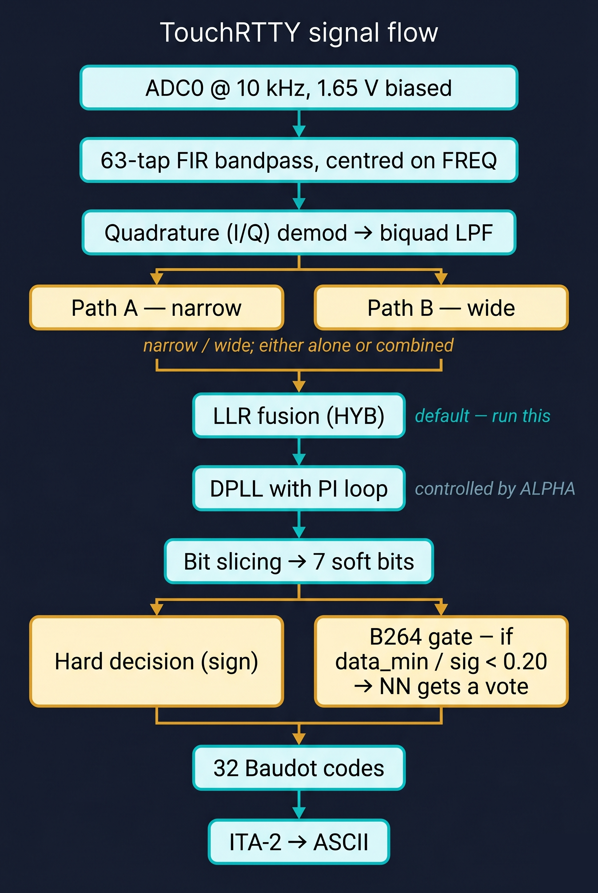

# TouchRTTY

> 🇬🇧 [Read in English](README.md)

Карманный RTTY-декодер, которому реально можно доверять на слабом сигнале.

<p align="center">
  
  
</p>

Это Raspberry Pi Pico 2 (RP2350) с написанным с нуля SDR-style
демодулятором и маленькой нейронкой, которая включается, когда сигнал
становится совсем плохим. На том же аудио, где 2Tone разваливается в
случайные буквы, здесь идёт читаемый телетайп. Замерял. Цифры ниже —
не пустой звон.

> [!IMPORTANT]
> Нужен именно **Pico 2 (RP2350)** — не старый RP2040. У меня в горячей
> петле FPU от Cortex-M33 и больше SRAM, чем влезает в старый чип. Не
> усложняй себе жизнь.

---

## Где я сейчас

Последний релиз — **v2.0.0** (firmware build B265, NN weights v13).
Если ничего больше не трогаешь и хочешь сразу лучший мой декодер —
бери [`TouchRTTY_v2.0.0.uf2`](TouchRTTY_v2.0.0.uf2) из корня репо.

Полные release notes: [`RELEASE_v2.0.0.md`](RELEASE_v2.0.0.md).

Чем интересен этот билд:

* **Нейронка реально помогает.** Раньше NN была неоднозначной —
  лучше у порога, хуже на комфортном сигнале. v13 это починила. NN-ON
  не хуже NN-OFF на любом SNR, который я прогонял, и заметно лучше
  ниже −14 dB.
* **Видно, что нейронка думает.** Новая serial-команда `DUMP FRAMES ON`
  стримит все семь soft-bit значений каждого Baudot-фрейма плюс
  hard-decision label. Скармливаешь WAV декодеру, ловишь поток — и у
  тебя готовые labeled training data. Тот же цикл, по которому v13
  собрали.
* **UI стал проще.** NOTCH и VIT — теперь тоглы прямо в главном меню,
  а не закопаны в попап. Ошибки frame-rejection показываются на экране
  как одна красная `*`, а не полный токен `[ERR]`. Читается чище.

Подробнее — в [`CHANGELOG_B265.md`](CHANGELOG_B265.md).

---

## Как смотрится против 2Tone

Сравнивал с [2Tone 26.01a](http://www.tonemap.com/Software.html)
(уважаемый декодер David'а G3YYD), усредняли по трём random seeds,
SNR-лесенка от −4 до −22 dB шагом 2 dB по 30 секунд на бин. То же
самое аудио в обоих декодерах через один Voicemeeter loopback.

| SNR | TouchRTTY NN-OFF | TouchRTTY NN-ON (v13) | Что делает 2Tone |
|---:|---:|---:|---|
| −12 | 16.2 % | **15.5 %** | Начинает ломаться; ~22 pp реальных ошибок |
| −14 | 32.2 % | **23.4 %** (σ 1.5) | В основном шум |
| −16 | 77.7 % | **55.3 %** (σ 3.2) | ~58 pp реальных ошибок — случайные буквы |
| −20 | 88.2 % | **80.4 %** (σ 2.3) | Давно умер |

Всё, что ≤ 14 % на TouchRTTY, — это в основном артефакт cyclic-rotation
в cer_analyze, а реальный декодированный текст читается чисто. Ниже
этого baseline'а **TouchRTTY выдаёт читаемый телетайп там, где 2Tone
показывает абракадабру.** Честный reference run лежит в
[`datasets/logs/bench_auto_v2/`](datasets/logs/bench_auto_v2/)
(commit `af4bdd0`).

Низкое стандартное отклонение у NN-ON (1.5–3.2 pp на ключевых SNR)
важнее самих цифр — это значит, улучшение воспроизводится между
сидами, а не один случайный удачный прогон.

---

## С чего начать

| Если хочешь… | Открывай |
|---|---|
| Подключить железо | [Hardware setup](docs/HARDWARE_SETUP.ru.md) |
| Гонять по USB | [Serial-команды](docs/SERIAL_COMMANDS.ru.md) |
| Пользоваться тачскрином | [Гайд по меню](docs/MENU_GUIDE.ru.md) |
| Обучить свою нейронку | [Тренировка NN](docs/NN_TRAINING.ru.md) |
| Запустить бенч | [Bench-тулинг](docs/BENCH_TOOLING.ru.md) |
| Узнать что дальше в планах | [Roadmap](docs/ROADMAP_OPTIMIZATION.ru.md) |
| Просто сгенерить тестовый сигнал в браузере | [`tools/rtty_simulator.html`](tools/rtty_simulator.html) |

---

## Что дальше в планах

v2.0.0 закрыла стратегическую цель «обогнать 2Tone» для RTTY. Запас
по работе ещё большой. Полный backlog с приоритетами и обоснованиями
лежит в [`docs/ROADMAP_OPTIMIZATION.ru.md`](docs/ROADMAP_OPTIMIZATION.ru.md)
§9, а короткий список такой:

* **SITOR-B / NAVTEX FEC** — 100 baud / 170 Гц с CCIR 476 time
  diversity. Естественный следующий протокол, как только RTTY доведён.
* **Real-air NN oracle pipeline** — DWD template matcher, чтобы
  размечать неопределённые фреймы против ground truth. Путь сдвинуть
  порог −16 dB ещё на 5–10 pp.
* **CW (Морзе) декодер** — K-means based, на том же dual-IQ
  фронт-энде.
* **SD-карта для логов** — exFAT, план Phase 4. Распиновка уже в
  [hardware setup](docs/HARDWARE_SETUP.ru.md), можно подпаивать
  сейчас.
* **FT8 / FT4** — узкополосные режимы, гораздо больше compute, но у
  dual-core запас есть.
* **WEFAX** — HF weather fax. Переиспользует pipeline спектра.
* **DRM** — Digital Radio Mondiale, на более долгий горизонт.
* **UI палитры / скины** — косметика. «Hacker green» и компания.

Плюс research-backlog по качеству декодера (Symbol-level MLSE,
Gardner clock recovery, n-gram language model, IQ-direct вход и пр.)
собран в [`docs/NEIGHBOR_IDEAS.ru.md`](docs/NEIGHBOR_IDEAS.ru.md).

---

## Как сигнал течёт через коробку

Скармливаешь ground-referenced аудио (1.65 В bias, line level) в GP26.
Дальше так:

<p align="center">
  
</p>

Core 0 владеет 10 кГц hard-real-time петлёй (около 7 % CPU). Core 1
держит UI, 1024-point FFT для водопада, тач и USB-консоль (около
20 % CPU). Запас по обоим ядрам нормальный.

Dual-IQ пути с LLR fusion — это скелет, оставшийся с Phase 9. Сам
декодер тот же. Изменилось то, что NN теперь опциональная, через гейт,
и переучена; плюс эргономика на экране.

---

## Собрать самому

```bash
git clone --recurse-submodules https://github.com/Alex-Electron/TouchRTTY.git
cd TouchRTTY
mkdir build && cd build
cmake -G Ninja -DPICO_SDK_PATH=/path/to/pico-sdk ..
ninja
picotool load -f TouchRTTY.uf2
```

Нужен Pico SDK 2.x и ARM-тулчейн. Папка `build/` в gitignore, так что
cmake пересоберёт всё при первом запуске. PIO и LovyanGFX подтянутся
сабмодулями через `--recurse-submodules`.

Если `picotool` не настроен — кидай получившийся `.uf2` на
mass-storage диск `RPI-RP2` по-старинке: зажми BOOTSEL и воткни Pico.

---

## Quick start: сигнал → текст

1. Подключи дисплей, тач и bias-сеть на аудио — пины в
   [Hardware setup](docs/HARDWARE_SETUP.ru.md).
2. Прошей `TouchRTTY_v2.0.0.uf2`.
3. Скорми аудио — линейный выход PC, AF-jack настоящей рации или
   WebSDR в браузере через виртуальный аудиокабель.
4. Тапни **SEARCH** на экране. Скан 300–3000 Гц, ловит самый
   RTTY-похожий пик.
5. Выбери Baud / Shift / Polarity в нижнем баре:
   * Любительский RTTY → `B 45` `S 170` `NOR`
   * DWD weather → `B 50` `S 450` `NOR` (если строишь USB)
   * SITOR / NAVTEX → `B 75` `S 170`
6. Включи `AFC`.
7. Открой `MENU` → переключи `PATH` на `HYB+NN`.

Текст пойдёт в среднюю зону экрана. Serial-консоль зеркалит его и
вставляет `[ERR]` там, где декодер отверг фрейм.

---

## Что где в репо

```
.
├── README.md                  ← английский (primary)
├── README.ru.md               ← этот файл
├── CHANGELOG_B265.md          ← что в B265
├── TouchRTTY_v2.0.0.uf2     ← готовая прошивка
├── src/
│   ├── display/               ← ILI9488 + PIO
│   ├── dsp_pipeline.{cpp,hpp} ← Core 0, 10 кГц петля
│   ├── dsp/nn_weights.h       ← production-веса v13
│   ├── serial_commands.cpp    ← CLI parser
│   └── ui/                    ← водопад / меню / eye diagram
├── tools/
│   ├── train_nn_torch.py      ← PyTorch trainer (рецепт v13)
│   ├── bench_replay.py        ← играем WAV, ловим decode по serial
│   ├── nn_sweep_compare.py    ← AWGN-лесенка NN-OFF vs NN-ON
│   ├── overnight_runner.sh    ← цикл train+sweep без надзора
│   ├── parse_dump_frames.py   ← B265 dump stream → npz для тренировки
│   └── rtty_simulator.html    ← браузерный генератор RTTY
├── datasets/
│   ├── nn_archive/            ← каждый weight blob, что я тренировал
│   └── logs/                  ← bench evidence (compare-таблицы)
└── docs/                      ← пять long-form гайдов
```

Каждый NN-эксперимент закоммичен вместе с multi-seed evidence в
`datasets/logs/nn_compare_v*_s{42,43,44}/`. Если будущее изменение
вдруг даст регресс — откатить к любому раннему weight blob — это один
`cp`, потому что всё заархивировано.

---

## Если хочешь контрибьютить

DSP-код — из тех, что заметно улучшается, когда люди его реально гоняют
в эфире и жалуются. Если у тебя на антенне работает хуже, чем у меня, —
заведи issue с коротким аудиоклипом. Гораздо полезнее, чем общее «не
работает».

Для улучшений NN — multi-seed bench (минимум 3 сида) до того, как
предлагаешь рецепт. Single-run улучшения на SNR ≤ −16 dB почти всегда
шум. Я это на себе проверили, спалив много compute.

---

## Спасибо

* Raspberry Pi Pico SDK, BSD-3-Clause.
* [LovyanGFX](https://github.com/lovyan03/LovyanGFX) — TFT-графика, FreeBSD.
* 2Tone от G3YYD, упоминается только как бенчмарк — не редистрибьютим.
* Метеослужба DWD — за то, что круглосуточно даёт предсказуемый
  тестовый сигнал.

Если собрал и запустил в эфире — пришёл мне скриншот декодированного
текста. Интересно посмотреть, какие станции ловишь.
