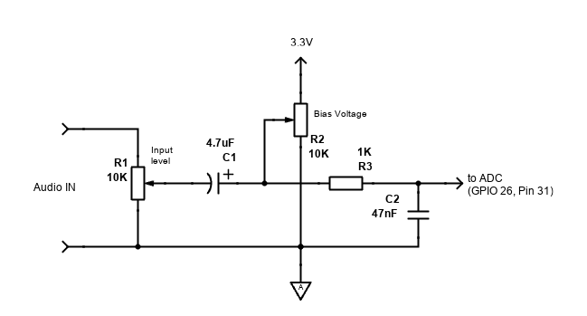

# Wiring it up

> 🇷🇺 [Читать на русском](HARDWARE_SETUP.ru.md)

A short shopping list, the pin map (with physical pins for the
breadboard-with-tweezers crowd), the audio adapter circuit, and a
few things to check if the first power-up looks wrong.

## What you need

* **Raspberry Pi Pico 2 (RP2350)** — *not* the original RP2040. I lean
  on the M33's FPU and need more SRAM than the older chip has.
* **ILI9488 480×320 SPI TFT** with resistive XPT2046 touch overlay.
  Most "3.5 inch SPI" displays on AliExpress, Amazon, etc., fit this
  description.
* An audio source — could be a PC line-out, a real radio's AF jack, a
  Bluetooth speaker fed by a phone, anything that gives you a few
  hundred mV peak-to-peak of analog audio.
* An audio adapter board (a few resistors and caps, schematic below).
* 5 V USB power for the Pico — its 3.3 V rail powers the display
  logic, but the backlight LED string typically wants 5 V.
* *(Optional)* A rotary encoder module with a push-button switch.
  Useful for the physical "factory reset" button on GP4.
* *(Phase 4 / future)* A MicroSD card module on SPI1 for logging.

The Pico 2 costs about $5, the display $10–15. Total bill of
materials under $25 if you scrounge passives, plus a USB cable.

---

## Pin map

### Display (ILI9488) — SPI0

| Display pin | Pico GPIO | Physical pin | Function |
| :--- | :--- | :--- | :--- |
| **VCC** | — | Pin 36 | 3.3 V power (3V3_OUT) |
| **GND** | — | Pin 38 | Ground |
| **CS**  | GP17 | Pin 22 | LCD chip select |
| **RESET** | GP21 | Pin 27 | Hardware reset |
| **DC / RS** | GP20 | Pin 26 | Data / command |
| **SDI (MOSI)** | GP19 | Pin 25 | SPI data in |
| **SCK** | GP18 | Pin 24 | SPI clock (60 MHz) |
| **SDO (MISO)** | GP16 | Pin 21 | Defined in code; leave physically disconnected to reduce bus noise |
| **LED** | — | Pin 36 | Backlight power (3V3_OUT) |

The display uses a PIO state machine at 60 MHz for the pixel stream
and SPI0 at 24 MHz for commands. If you got a clone that flickers or
shows garbage at 60 MHz, drop the PIO frequency in
[`src/display/ili9488_driver.h`](../src/display/ili9488_driver.h)
to 30 MHz first.

### Touch (XPT2046) — SPI1

| Touch pin | Pico GPIO | Physical pin | Function |
| :--- | :--- | :--- | :--- |
| **T_CLK** | GP10 | Pin 14 | SPI clock (2.5 MHz) |
| **T_CS**  | GP15 | Pin 20 | Touch chip select |
| **T_DIN** | GP11 | Pin 15 | SPI TX (MOSI) |
| **T_DO**  | GP12 | Pin 16 | SPI RX (MISO) |
| **T_IRQ** | GP14 | Pin 19 | Interrupt (also used as boot-calibration trigger) |

### Audio input

| Component | Pico GPIO | Physical pin | Function |
| :--- | :--- | :--- | :--- |
| **Biased audio signal** | GP26 | Pin 31 | ADC0 input |
| **Audio ground** | — | Pin 33 | Analog ground (AGND) — *not* a regular digital GND |

### Rotary encoder switch (optional but recommended)

The full A/B rotary lines aren't wired up yet — only the push-button
switch is used. It serves as a hardware "I broke something, take me
back to factory" button, plus boot-time touch recalibration.

| Encoder pin | Pico GPIO | Physical pin | Function |
| :--- | :--- | :--- | :--- |
| **SW (switch)** | GP4 | Pin 6 | Push button to GND |
| **CLK / A** | *TBD* | — | Reserved for future use |
| **DT / B**  | *TBD* | — | Reserved for future use |
| **GND** | — | Any GND | Ground |

You don't strictly need this — the same reset paths exist from the
on-screen menu (`MENU → DIAG → RST`). But the physical button is
nice when the touchscreen itself is what's broken.

### SD card (Phase 4 — future) — SPI1

The SD card module shares SPI1 with the touch controller. It needs
its own dedicated chip-select pin. Not used by the current firmware
yet, but wire it up if you're building the hardware once and want it
ready for Phase 4 logging.

| SD card pin | Pico GPIO | Physical pin | Function |
| :--- | :--- | :--- | :--- |
| **MOSI / CMD** | GP11 | Pin 15 | SPI1 TX (shared with T_DIN) |
| **MISO / D0**  | GP12 | Pin 16 | SPI1 RX (shared with T_DO) |
| **SCK / CLK**  | GP10 | Pin 14 | SPI1 clock (shared with T_CLK) |
| **CS / DAT3**  | GP13 | Pin 17 | Dedicated SD chip select |
| **VCC** | — | Pin 36 or 40 | 3.3 V or 5 V (depends on module) |
| **GND** | — | Any GND | Ground |

---

## The audio input adapter

The Pico's ADC is single-ended and reads 0 to 3.3 V. Your audio
source is AC (centered around 0 V). To make them play nicely you
need a small adapter circuit that DC-blocks the source, biases the
input to mid-rail (1.65 V), and gives you a level knob plus a
low-pass filter to keep RF junk out.



The circuit:

1. **R1 (input level)** — 10 kΩ potentiometer to set audio volume
   coming from the source. Lets you trim a hot PC line-out without
   touching the source side.
2. **C1 (DC block)** — 4.7 µF capacitor to strip any DC offset
   coming in. Tantalum or film, polarity not critical for symmetric
   AC audio but use the + pin toward the source side anyway.
3. **R2 (bias voltage)** — 10 kΩ trimpot between 3.3 V (Pin 36) and
   AGND, wiper to the ADC input. Trim it for *exactly* 1.65 V at the
   wiper while no audio is playing. Watch the ADC midpoint number in
   the on-screen top bar — it should sit at 1.65 V ±0.05 V.
4. **R3 + C2 (low-pass filter)** — 1 kΩ resistor in series with a
   47 nF cap to AGND. Forms a single-pole RC LPF with a corner
   around 3.4 kHz, which kills RF and aliasing energy before the ADC.

**Important:** ground all of this to the Pico's **AGND (Pin 33)**,
not a regular digital ground. The analog ground is internally
isolated from the digital one for exactly this reason — using DGND
adds 5–10 dB of broadband noise floor.

Final connection: wiper of R2 → through R3 → GP26 (Pin 31).

A few notes from doing this on a breadboard a few times:

* **Confirm the bias first**, with no audio playing. Send `STATUS`
  over serial — the "ADC midpoint" reading should sit within ±0.05 V
  of 1.65 V. If it's way off, trim R2 or check that R2 has both 3.3 V
  *and* AGND.
* If your source is a strong PC line-out (1 V+ swing) and you keep
  hitting the red CLIP indicator, back off R1 first. Then if it's
  still hot, drop C1 to 1 µF — a smaller cap + big swing saturates
  the ADC less on transients.
* If your source is a crystal earpiece or piezo, the source
  impedance is huge and R1 loads it down. Buffer through a single
  op-amp (TL072 or similar) first.
* For a real radio's AF-out jack: most rigs have an internal divider
  giving you ~10–50 mV at full audio volume. That's fine — the
  Pico's ADC is happy with that, AGC compensates. You can probably
  short R1 with a wire and skip the potentiometer entirely.

---

## First boot and touch calibration

The very first time the firmware boots on a fresh device (or after a
factory reset), it can't trust the touch calibration that's in
flash — there isn't any. So it runs the 4-corner calibration overlay
*before* drawing the normal UI.

### What you'll see

Right after the splash, the screen shows a black background with a
small crosshair in **one of the corners** (the order is
top-left → top-right → bottom-right → bottom-left). A short
instruction line at the bottom says where to tap.

### The procedure

1. **Use a stylus or your fingernail tip.** A fat fingerprint
   spreads the touch contact patch and shifts the calibration —
   usable, but worse. A pen tip or guitar pick edge is best.
2. **Tap the centre of the crosshair**, hold for ~200 ms, lift
   cleanly. The firmware averages the contact for ~10 samples, so a
   quick stab can register slightly off.
3. **Repeat for all four corners.** As each corner registers, its
   crosshair disappears and the next one appears.
4. After the fourth corner the firmware does an affine-fit, draws a
   confirmation grid for ~1 second, and drops you into the normal UI
   with the new calibration applied in RAM.
5. **`SAVE` it!** Calibration is *not* persisted to flash
   automatically. Open `MENU → TUNE → SAVE` from the on-screen UI.
   If you skip this, the calibration is fine for this session but a
   power-cycle puts you right back into the 4-corner overlay.

### If you mistapped

The firmware doesn't have a built-in "undo this corner" — you'd have
to power-cycle and start the overlay over. Two ways to redo:

- **Short-press GP4 at boot** (see encoder section above) — clears
  *only* the touch calibration and re-runs the overlay. All other
  settings (FREQ, BAUD, AFC habit, NN weights, etc.) survive.
- **`MENU → DIAG → RST → YES`** — full factory reset. Wipes
  everything in flash, then re-runs calibration on the next boot.
  Use this when you've also messed up tuning and want a clean slate.

### Sanity-check after calibration

Open the menu. Tap each of the four corners of the on-screen menu
grid. If the tap registers in the same cell you tapped — calibration
is good. If it registers one cell off — the affine fit was
off-centre. Easier to just redo it with a sharper tap point.

---

## Resetting from the encoder button (GP4)

The push-button on GP4 is sampled once during boot. It has two
behaviors based on how long you hold it:

| Hold duration | What happens | What survives |
| :--- | :--- | :--- |
| Not pressed | Normal boot | Everything |
| **Short press** (< 1 s) at boot | Re-run 4-corner touch calibration only | Everything except touch calibration |
| **Hold ≥ 3 s** at boot | Full factory reset → wipe settings flash → reboot → re-run calibration on next boot | Nothing — back to factory defaults |

In both cases the rest of the firmware boots normally after the
calibration overlay finishes. The 3-second hold is intentionally
long so a stray bump doesn't nuke your DSP tuning by accident.

If you don't have a physical encoder wired up, the same actions are
on the on-screen menu:

- Recalibrate touch only: there isn't a one-button path for this in
  the UI, because if you can navigate the menu, your touch is
  probably fine. The closest is `MENU → DIAG → RST → YES` (full
  reset, includes recalibration).
- Full factory reset: `MENU → DIAG → RST → YES`.

---

## Feeding it audio

### Option 1: WebSDR through a computer

The easiest way to see Bohemia from your living room. I use the
University of Twente WebSDR or DWD's own one as test signals
constantly.

1. Open a WebSDR in your browser.
2. Tune to a known RTTY freq:
   * DWD weather on **4582 / 10100.8 kHz** (50 baud, 450 Hz, USB)
   * Russian commercial **4476 / 5447 / 7449 kHz** (50 baud, 170–450 Hz)
   * Amateur RTTY **7035–7040 / 14080–14100 / 21080 kHz** (45.45, 170)
3. Set the demodulator to **USB** — most RTTY traffic is tuned this
   way. If you tune LSB instead, Mark and Space swap and you'll need
   to press `INV` on the Pico.
4. Route the browser's audio to the Pico's ADC. Three ways:
   * **Voicemeeter Banana** (Windows) — set browser output to
     Voicemeeter virtual cable, route that to a physical audio output
     on your PC, run a 3.5 mm cable to the bias network.
   * **Loopback cable** — straight 3.5 mm cable from PC headphone jack
     into the bias network.
   * **Air gap** — PC speaker → microphone or pickup near the Pico
     ADC. Surprisingly works, but obviously noisier.
5. On the Pico, tap **SEARCH**. It scans 300–3000 Hz and locks onto
   the strongest RTTY-looking peak. Enable **AFC** for drift tracking.

### Option 2: An actual radio

Take an AF-out / line-out / SP-out from your radio, run through the
bias network, into GP26. If your radio only has a headphone jack,
back off R1 (the potentiometer) so the signal coming into C1 is
below 1 Vpp.

---

## Flashing the firmware

### Pre-built `.uf2` (easiest)

Releases live in the repo root after a build-number bump (right now
that's `TouchRTTY_v2.0.0.uf2`).

Method A — BOOTSEL drag-and-drop:

1. Hold `BOOTSEL` on the Pico while plugging the USB cable in.
2. The Pico mounts as `RPI-RP2` mass storage.
3. Copy the `.uf2` onto the drive. The Pico reboots into the new
   firmware automatically.

Method B — `picotool`:

```bash
picotool load -f TouchRTTY_v2.0.0.uf2
```

### Building from source

Needs Pico SDK 2.x and an ARM toolchain. CMake-driven.

```bash
git clone --recurse-submodules https://github.com/Alex-Electron/TouchRTTY.git
cd TouchRTTY
mkdir build && cd build
cmake -G Ninja -DPICO_SDK_PATH=/path/to/pico-sdk ..
ninja
picotool load -f TouchRTTY.uf2
```

The `build/` directory is gitignored, so cmake will regenerate
everything on first run. The PIO files and LovyanGFX submodules come
along with `--recurse-submodules`.

---

## Serial console

After flashing, the Pico shows up as USB CDC ACM:

* Windows: `COM<N>` in Device Manager
* Linux: `/dev/ttyACM0`
* macOS: `/dev/tty.usbmodem*`

Open it at 115200 8N1. Either line ending works (`\r\n` or `\n`).

```bash
$ echo "VERSION" | python tools/send_serial_cmd.py --port COM27
>> TouchRTTY Phase9 B265 (built May 12 2026 05:42:11)
```

If that responds, you're good. Full command reference is in
[`SERIAL_COMMANDS.md`](SERIAL_COMMANDS.md).

---

## When the first boot looks wrong

| Symptom | Probably means |
|---|---|
| Screen is black or garbled | Check SPI wiring. Slow PIO down to 30 MHz first; clones sometimes don't tolerate 60 MHz. |
| Screen shows colours but everything is mirrored or off | Display in wrong mode. Check `src/ili9488_init.cpp` — most clones want mode 11, some need mode 0. |
| Touch dead | Check `T_IRQ` (GP14) and `T_CS` (GP15) are wired. The XPT2046 also needs the SPI1 lines on GP10/11/12. |
| Touch is mirrored, rotated, or wildly off | Run the calibration again (short-press GP4 at boot). If still wrong after a clean 4-corner sequence, edit `src/touch_xpt2046.cpp` — sometimes X and Y need swapping for a specific overlay orientation. |
| Top bar shows red clip indicator constantly | Audio source too loud. Back off R1, or drop a series resistor in front of the bias network. |
| Top bar shows almost no signal | Check audio is present at GP26 (scope or oscilloscope). Or use `DUMP MS` over serial to see the mark/space envelopes. |
| ADC midpoint not 1.65 V | Trim R2 with no audio playing. If you can't get there, check that R2 has both 3.3 V and AGND wired up. |
| ERR rate stuck near 100 % | Either wrong polarity (press `INV`) or wrong baud/shift. Try `BAUD AUTO` and `SHIFT AUTO`. |
| Constant `[ERR]` flood at low signal | Squelch too low. Drop into Tuning Lab and bump `SQ` to 8–12 dB. |
| `STATUS` says `SQ=SHUT` permanently | Squelch threshold higher than the actual SNR. Either lower SQ or improve antenna. |
| Settings vanish after every reboot | You forgot to `SAVE`. From the screen: `MENU → TUNE → SAVE`. |
| Stuck in 4-corner calibration overlay every boot | Same — you tapped the corners but never `SAVE`d. Calibrate once more, then `MENU → TUNE → SAVE`. |

If you really break the calibration: `MENU → DIAG → RST → YES`, the
Pico wipes its settings flash and reboots, and re-runs the 4-corner
touch calibration on next power-up.
