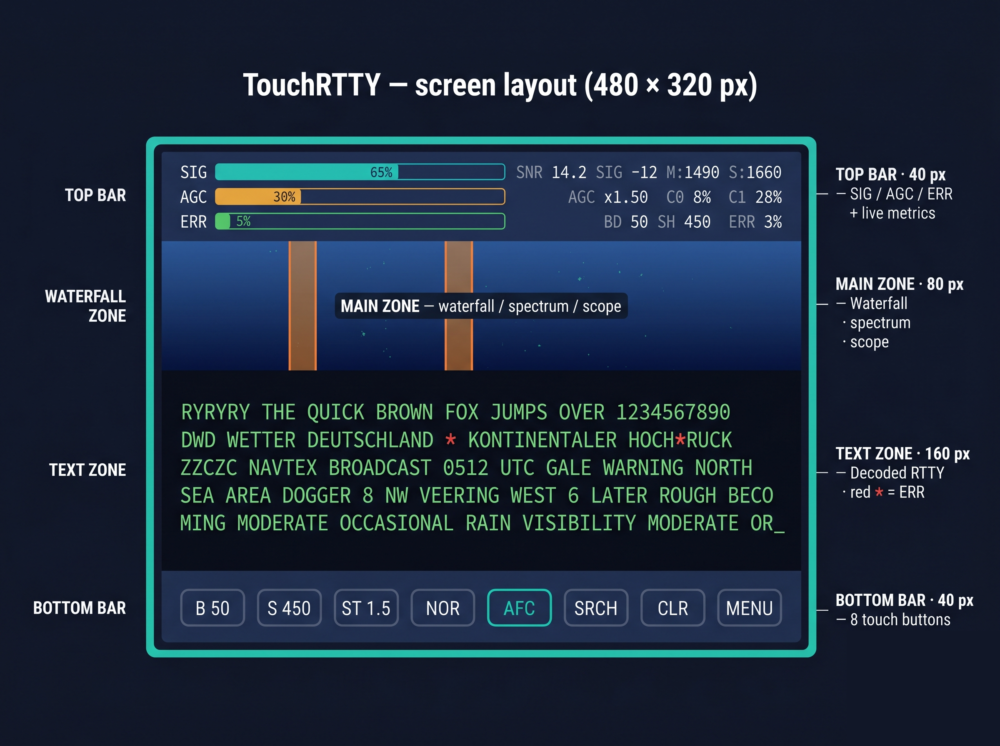

# Пользуемся тачскрином

> 🇬🇧 [Read in English](MENU_GUIDE.md)

ILI9488 480×320 — резистивный тач плюс три постоянных зоны и пара
оверлей-экранов. После десяти минут залипания в коробку этот документ
уже не нужен, но первые десять — вот он.

Большая картина: вверху top bar с живыми метриками, середина делится
на визуализатор и зону декодированного текста, внизу — восемь кнопок
быстрого доступа. Всё остальное (меню, Tuning Lab, диагностика) —
оверлеи на середину, когда тапаешь.

  

> *Иллюстративный рендер — не пиксель-точный по исходнику.* Реальные
> высоты из `src/ui/UIManager.hpp`: TOP BAR 34 px, полоса частотных
> MARKER'ов 14 px (между top bar и водопадом), DSP-зона (водопад /
> спектр / scope) 64 px, TEXT-зона 160 px (самая большая — половина
> экрана), BOTTOM BAR 48 px. На картинке выше это художественная
> прорисовка раскладки, а не настоящий 1:1 скриншот.

---

## Нижний бар

Эти восемь кнопок есть всегда. Тап = цикл / тогл.

**1. Baud rate.** Цикл `B 45 → B 50 → B 75 → B 100 → B:AUTO`.
Авто-детект нормальный — если не знаешь, оставь AUTO.

**2. Shift.** Цикл по 85, 170, 200, 340, 425, 450, 500, 850 Гц, потом
AUTO. Для любительства — 170. Для DWD — 450. Вне этих двух случаев
AUTO обычно ловит за несколько секунд.

**3. Stop bits.** 1.0 / 1.5 / 2.0 / AUTO. 1.5 — дефолт и правильный
ответ в 95 % случаев. Авто-детект смотрит gap-статистику и выбирает
самое вероятное.

**4. Polarity.** `NOR` / `INV` / `NOR[A]` / `INV[A]`. Суффикс `[A]`
означает auto-режим — декодер сам флипнет, если ошибки держатся
высокими слишком долго. Без `[A]` — заблокирован руками. Цвет рамки:
cyan = auto, magenta = ручная блокировка.

**5. AFC.** `AFC:ON` / `AFC:OFF`. Трекает дрейф до ±100 Гц от
настроенной `FREQ`. Почти всегда хочешь ON. OFF имеет смысл, только
если делаешь что-то странное вроде измерения дрейфа сам.

**6. SEARCH.** Тап — FFT-скан 300–3000 Гц, посадка на самый сильный
RTTY-похожий пик. Во время скана кнопка пишет `SRCH..` (жёлтый).
Закончит — коротко `FOUND!` (зелёный) или `NONE` (красный), потом
возврат к `SEARCH`.

**7. CLEAR.** Сбрасывает DSP-интеграторы — gain AGC, фазу DPLL,
скользящее окно error-rate. Настройки не трогает. Полезно, если AGC
накачался на статике и не хочет отпускать.

**8. MENU.** Тогл меню-оверлея. Тап — открыть, тап — закрыть.

Кнопки подсвечиваются зелёным, когда их параметр сейчас ON.

---

## Top bar

Три ряда в 33 пикселях вертикали, каждый — бар плюс числа.

**Ряд 1 — SIG.** Горизонтальный бар абсолютного уровня сигнала
(−80 до −10 dB FS). Справа: SNR в dB, raw signal dB, две
mark/space-частоты, на которые декодер думает, что залочился,
AFC-offset от настроенной FREQ.

**Ряд 2 — AGC.** Бар текущего gain'а AGC (0–40 dB). Числа рядом: AGC
×factor, CPU-нагрузка обоих ядер, FPS UI, mid-point ADC в вольтах
(должен сидеть около 1.65 В; если сильно мимо — bias-сеть просит
подстройки).

**Ряд 3 — ERR.** Бар скользящего error-rate за последние 100 фреймов
(0–100 %). Числа: эффективные baud и shift, на которые декодер
залочен, плюс мини-иконки состояния NN / NOTCH / VIT и флаг
клиппинга, если ADC насыщается.

С правого края — крохотные индикаторы состояния FIGS / LTRS, намёк
на неопределённую полярность, состояние squelch. Для повседневной
работы не критично.

---

## Меню-оверлей

Тапни `MENU` (кнопка 8 внизу) — text zone заменится сеткой 4×3. Тап
по слоту — действие, ещё тап `MENU` — закрыть.

Раскладка, top-left → bottom-right:

* **DISP: WF / SPEC / SCOPE** — режим визуализатора по кругу.
* **DIAG** — открыть экран диагностики.
* **TUNE** — открыть Tuning Lab.
* **PATH: A / B / HYB / HYB+NN** — путь декодирования по кругу.
  Четыре состояния, не три: четвёртое — «HYB с включённым NN
  классификатором». Цикл здесь = `PATH HYB; NN ON` по serial.
* **NOTCH: ON / OFF** — тогл LMS-notch chain.
* **VIT: ON / OFF** — тогл soft-Viterbi frame gate.
* (шесть пустых слотов на будущее)

Заметишь — это компактнее, чем в старых билдах, где NOTCH и VIT
требовали попап. Свернули в слоты 4 и 5: меньше тапов, проще
держать в голове.

---

## Tuning Lab

Здесь крутишь DSP. Открывается из `MENU` → `TUNE`.
Сверху eye diagram, ниже сетка кнопок 6×2.

Eye diagram — самый полезный realtime-фидбек из всех. Накладывает
последовательные bit-трассы с phosphor persistence (~96 % retention
на фрейм). Чистый глаз = DPLL лочится. Размытый = подними ALPHA.
Неправильные переходы глаза = неправильный bit timing.

Сетка кнопок — 6 столбцов на 2 ряда:

Ряд 0:

| `A-` | A val | `A+` | `K-` | K val | `K+` |
|---|---|---|---|---|---|

* `A` — alpha DPLL (loop bandwidth). −/+ шагом 0.005, диапазон
  0.005–0.200.
* `K` — фактор полосы LPF. −/+ шагом 0.05, диапазон 0.3–2.0.

Ряд 1:

| `SQ-` | SQ val | `SQ+` | `DUMP` | (пусто) | `SAVE` |
|---|---|---|---|---|---|

* `SQ` — порог SNR для сквелча. ±1 dB шаг.
* `DUMP` — тогл периодического диагностического потока по serial.
  То же, что `DIAG ON/OFF` с serial-консоли.
* `SAVE` — записать *всё* (настройки, калибровку) во flash.

Выход — снова `MENU`. Eye diagram ненадолго виден и при возврате
через меню, так что не бойся потерять окно.

---

## Экран DIAG

`MENU` → `DIAG`. Показывает гистограмму символов (как часто каждый
ITA-2 код был декодирован недавно) и zero-bias meter —
горизонтальный индикатор того, насколько ADC-bias смещён от
идеальной середины 1.65 В. Зелёный в пределах ±50 мВ, синий — дальше.
Полезно, чтобы убедиться, что bias-сеть хорошо подстроена.

Две action-кнопки внизу:

* **FONT: BIG / MED / SML / TINY** — цикл по четырём размерам шрифта
  на экране. Ширина строки подстраивается автоматически: 55 (BIG),
  62 (MED), 73 (SML), 90 (TINY).
* **RST** — открыть reset-confirm dialog.

---

## Reset-confirm dialog

Тапни `RST` — получишь полноэкранный модал: большой YES справа,
NO слева.

* **YES** вычищает всю settings-страницу flash и триггерит
  watchdog-перезагрузку.
* **NO** возвращает на экран DIAG, без последствий.

Модал ест случайные тапы за пределами кнопок, так что нечаянно не
закроешь. Но если ткнул YES — сброс необратим: твои подстройки
alpha, AFC-привычка, калибровка тача — всё пропадёт. Не тыкай
просто так.

После сброса первый boot покажет 4-corner калибровку — тап в каждый
угол, потом `SAVE` из Tuning Lab, когда всё ровно.

---

## Режимы визуализатора

Слот DISP — три режима по кругу:

* **WF** (waterfall) — вертикально-скроллящийся спектрограф, дефолт.
  Время идёт вниз (~7 пикселей в секунду), частота по горизонтали.
  RTTY-сигнатуру в две полосы хорошо видно.
* **SPEC** (spectrum analyzer) — амплитуда vs частота, с маркерами
  пиков и cursor'ами mark/space поверх. Полезно, когда хочешь видеть
  *сейчас*, а не историю.
* **SCOPE** (Lissajous / XY) — рисует I против Q. На чистом RTTY
  видишь два кластера в bipolar pattern. FT8 / PSK тут выглядят
  совершенно иначе — иногда удобно как diagnostic.

---

## Что показывает текст на экране

| Символ | Значение |
|---|---|
| `A`-`Z`, `0`-`9`, пунктуация | Успешно декодированный символ |
| `[LTRS]` / `[FIGS]` | Baudot shift markers. В serial показываются, на экране скрыты. |
| `*` (красная) | Фрейм, провалил валидацию (B243 / B264 / sign-threshold). Полный токен `[ERR]` уходит в serial. |

Красная `*` — добавка B263. Раньше прошивка показывала `[ERR]` и на
экране тоже, и это сильно засоряло строку, мешало читать сам текст.
Один символ держит плотность строки читаемой.

Если надо точно посчитать ошибки — смотри процент ERR в top bar
(скользящее окно по последним 100 фреймам), это и есть метрика.
Считать `*`-глифы глазами на быстро скроллящемся тексте — ненадёжно.

---

## Когда не знаешь, куда тапать

| Что хочешь | Что делать |
|---|---|
| Декодить новый диапазон, не знаешь что там | Тапни `SEARCH`. Подожди. |
| Переключиться с любительского RTTY на DWD weather | Нижний бар: `B 45` → `B 50`, потом `S 170` → `S 450`. Полярность NOR. |
| На чистом сигнале сыпется ошибки | Попробуй `INV`. Если не помогло — открой Tuning Lab и чуть подними `K` (шире LPF). |
| NN делает только хуже | Поставь PATH на HYB (без +NN). Или `NN OFF` по serial. |
| Угробить всю настройку из-за плохого дня | `MENU` → `DIAG` → `RST` → YES. Начать с чистого. |
| Сохранить настройки между перезагрузками | `MENU` → `TUNE` → `SAVE`. |
