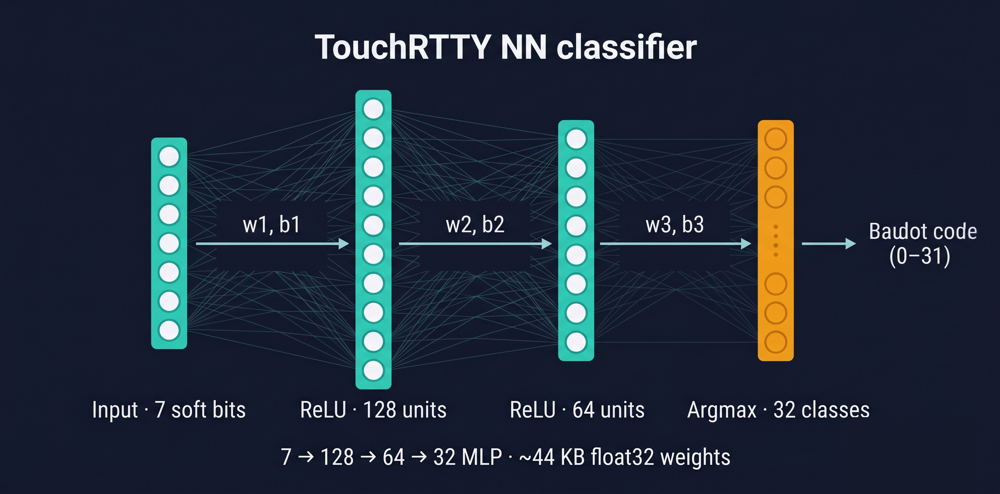

# Training the neural net

> 🇷🇺 [Читать на русском](NN_TRAINING.ru.md)

I ship a small (7→128→64→32, about 44 KB of float32 weights) MLP
classifier that gets a vote on Baudot frames where the soft-bit
pattern is uncertain. Production weights are committed at
[`src/dsp/nn_weights.h`](../src/dsp/nn_weights.h). If you want to
improve them or train your own for a different signal environment,
this is the doc.

It's reasonable to ask why I ship an NN for what's essentially a 5-bit
character problem. The short answer is that real-world Baudot frames
come with noise, ISI, fading and AGC artefacts that make the seven
soft-bit values not always cleanly bipolar — and at the SNRs I care
about (−14 to −20 dB), the simple sign-threshold decision is genuinely
wrong on 5–30 % of frames. The NN squeezes some of that error back out.

The harder question is *when* the NN should be allowed to overrule the
sign threshold. Early versions of this code let it run on every frame
and the result was a U-shaped performance curve: NN helped a lot at
threshold SNR, but actively hurt at comfortable SNR where the sign
decision was already correct. The B264 confidence gate fixed this — at
inference I only invoke the network when the weakest data bit's
magnitude is below 30 % of the estimated signal level. Above that I
trust the simple decoder, full stop.

---

## The architecture, end-to-end

<p align="center">
  
</p>

Inputs are 7 bipolar soft bits normalized by `sig_level`. Two
fully-connected ReLU layers (128 and 64 units), then a final dense
layer into 32 logits — one per Baudot code. Argmax picks the
predicted character.

Inference happens in [`src/dsp_pipeline.cpp`](../src/dsp_pipeline.cpp)
around line 530. The decision rule:

```cpp
if (nn_gate_open && nn_margin > 0.5)
    current_char = nn_argmax;
```

Where `nn_margin = top_logit − second_top_logit`. I trust the NN's
choice only if it's also confident — small margins fall back to the
hard decision. Belt and suspenders.

---

## The default training data

Both trainers (sklearn `tools/train_nn.py` and PyTorch
`tools/train_nn_torch.py`) call the same `generate_synthetic()` to
produce 32 × 15,000 = 480,000 training frames. Each frame is:

* The ideal Baudot pattern (±1 per bit) for one of 32 classes
* Plus Gaussian noise per-sample, with `σ` drawn from an exponential
  distribution with mean 0.35 (then clipped to [0.04, 1.10])
* Plus ISI mixing where each bit is blended with the previous one,
  alpha randomly in U(0.04, 0.32)
* Plus a per-frame signal scale in U(0.35, 2.2)

The exponential noise distribution is the unusual choice and the one
that mattered most. I landed on it after `noise_mean=0.28` produced
weights with a small but persistent regression at −12 dB, and
`noise_mean=0.40` overshot (made the model too "uncertain" about
everything). Mean 0.35 puts roughly 40 % of training mass into the
threshold zone (σ > 0.4), and the win at −16 dB was repeatable.

You can override the noise distribution with `TRAIN_NN_NOISE_MEAN`.

---

## The production recipe: v13

This is the one you should reproduce if you're starting from scratch.

```bash
TRAIN_NN_NOISE_MEAN=0.35 python tools/train_nn_torch.py \
    --epochs 60 \
    --n-synth 15000 \
    --weight-uncertain 3.0 \
    --out src/dsp/nn_weights.h
```

The headline trick is `--weight-uncertain 3.0`. The loss for each
training sample is multiplied by 3 when that sample's `data_min` is
below 0.30 — i.e. the frames the inference-time gate would actually
let the NN see. This focuses gradient attention on exactly the
hard-to-classify frames that NN needs to be good at.

This is the thing sklearn's `MLPClassifier` couldn't do — its `.fit()`
method doesn't accept `sample_weight`. That single missing feature is
the actual reason I ported to PyTorch.

What you should expect from a clean v13 run:

* Validation accuracy around 89.4 % (this number is moderately
  meaningless — see below)
* Training time about 5–7 minutes on a normal laptop CPU
* Total parameters: 11,360 floats = 44 KB

Then flash and run a multi-seed sweep (instructions below) to actually
measure whether it's any good.

After v13 you should see something like this:

| SNR | NN OFF mean | NN ON v13 mean | σ NN ON | Δ vs OFF |
|---:|---:|---:|---:|---:|
| −14 | 32.2 % | **23.4 %** | 1.5 | **−8.8** |
| −16 | 77.7 % | **55.3 %** | 3.2 | **−22.4** |
| −20 | 88.2 % | **80.4 %** | 2.3 | **−7.8** |

Critically the σ on NN ON is small — 1.5 to 3.2 pp at the SNRs that
matter. Wide σ would mean I got lucky on one seed; small σ means
the win is robust.

---

## Why validation accuracy lies to you

I learned this the hard way. Validation accuracy on the synthetic
held-out set sits around 89–91 % for almost every variant I tried.
v4 was 89.46 %, v9 was 91.02 %, v13 was 89.44 %, v17 was 89.42 %. The
numbers all look the same and tell you almost nothing about which
weights are actually better on the air.

The reason: validation set has the same SNR distribution as training
set, dominated by easy frames. A model that's 100 % perfect on easy
frames and 50 % random on threshold frames will look like 92 %
validation accuracy because there are way more easy frames. But its
on-air behaviour will be terrible at threshold.

So: **always run the multi-seed AWGN sweep on real hardware before
deciding whether new weights are better**. Validation accuracy is a
training-loop health check, not an oracle.

---

## Training options, in full

`tools/train_nn_torch.py` accepts:

| Flag | What it does |
|---|---|
| `--n-synth N` | Samples per class. Default 15,000 → 480k total. |
| `--epochs N` | Max epochs with cosine LR schedule. Default 80. |
| `--early-patience N` | Stop after N epochs without val_acc improvement. Default 12. |
| `--lr <float>` | Adam initial LR. Default 1e-3. |
| `--batch-size N` | Mini-batch size. Default 1024. |
| `--weight-decay <float>` | AdamW L2 decay. Default 3e-4. |
| `--label-smoothing <float>` | Cross-entropy label smoothing. I tried 0.05; it hurt at −14 and −16. |
| `--weight-uncertain <float>` | Per-sample weight multiplier for `data_min < 0.30` frames. **3.0 won; 5.0 overshot.** |
| `--dropout <float>` | Dropout. I tried 0.1; marginal, increased variance. |
| `--seed N` | Master seed for torch + numpy. Default 42. |
| `--real-npz <path>` | Mix in real-air frames from `parse_dump_frames.py`. Repeatable. |
| `--real-replicate N` | Replicate real samples N× before mixing. Default 1. |
| `--out <path>` | Output C-header path. Default `src/dsp/nn_weights.h`. |

Environment overrides:

* `TRAIN_NN_H1`, `TRAIN_NN_H2` — change hidden layer widths (default
  128, 64). v16 tried 160 / 80 with heavy regularization. Wider gave
  bigger absolute wins on some SNRs but much higher seed variance,
  so I didn't adopt it. If you've got specific noise patterns the
  baseline doesn't handle, worth experimenting.
* `TRAIN_NN_NOISE_MEAN` — synthetic noise exponential mean.
  Default 0.28 (legacy); v4/v13 production = 0.35.
* `TRAIN_NN_GATE_FILTER` — legacy from v7/v8; drops synthetic
  samples whose normalized `data_min` exceeds the threshold. Kept
  for reproducibility, doesn't help in practice.

---

## Capturing real-air training data

The B265 firmware has a `DUMP FRAMES` mode that streams every
validated frame's seven soft-bit values plus the hard-decision label
over serial. Combined with a known-good recording, you've got
labelled training data.

The full loop:

```bash
# 1. Configure decoder for the signal in your recording (DWD example)
python tools/send_serial_cmd.py --port COM27 << 'EOF'
BAUD 1
SHIFT 5
INV NOR
PATH HYB
NN OFF
DUMP FRAMES ON
EOF

# 2. Play the WAV through the audio loopback and log serial
python tools/bench_replay.py \
    --wavs datasets/recs_mono/your_recording.wav \
    --outdir datasets/logs/capture \
    --tag capture --device "LEN Q27h-10" --port COM27 \
    --gain 0.8

# 3. Parse FR records out of the log into a numpy training file
python tools/parse_dump_frames.py \
    datasets/logs/capture/capture_your_recording.log \
    --out datasets/training_real.npz

# 4. Train with real-air augmentation
TRAIN_NN_NOISE_MEAN=0.35 python tools/train_nn_torch.py \
    --epochs 60 --n-synth 15000 --weight-uncertain 3.0 \
    --real-npz datasets/training_real.npz \
    --real-replicate 3 \
    --out src/dsp/nn_weights.h
```

⚠️ **A caveat I learned the hard way.** My first real-air-augmented
attempt (v10) showed surprisingly high seed variance. Looking at the
captured data, most real-air frames are *clean* (data_min > 0.40) and
their hard-decision labels are trivially correct. So the model
mostly learns to mimic hard decision on easy frames — which doesn't
help, because I wanted the NN to *outperform* hard decision on hard
frames.

The trick to actually moving the needle with real data is to label
the *uncertain* frames against a **trusted oracle** — for example a
DWD template matcher that knows the expected wind-direction/day-of-week
format, so you can confidently say "the correct character at this
position was X, even though the decoder got Y". That work is on the
roadmap. Until then, real-air augmentation is mostly useful as
noise-pattern diversity, not label diversity.

---

## After training: flash and validate

```bash
cd build && ninja              # rebuild firmware with new weights
picotool load -f TouchRTTY.uf2 # flash via BOOTSEL
```

If picotool isn't on PATH:

```bash
~/.pico-sdk/picotool/2.2.0-a4/picotool/picotool.exe load -f TouchRTTY.uf2
```

Then do a multi-seed bench:

```bash
for s in 42 43 44; do
    python -c "import sounddevice as sd; sd._terminate(); sd._initialize()"
    python tools/nn_sweep_compare.py \
        --from -4 --to -22 --step 2 --dwell 30 \
        --center 2210 --sig-level 0.5 --seed $s \
        --out-dir datasets/logs/nn_compare_myrun_s${s}
done

python tools/aggregate_compare.py \
    datasets/logs/nn_compare_myrun_s42 \
    datasets/logs/nn_compare_myrun_s43 \
    datasets/logs/nn_compare_myrun_s44
```

The output is a table of NN OFF mean / NN ON mean / σ / Δ per SNR.
Compare your Δ-versus-NN-OFF against the v13 baseline above. If your
new variant has both lower mean *and* lower σ at the SNRs you care
about, you've improved on v13. If it has lower mean but higher σ,
it's seed-dependent and not safe to ship.

The runner `tools/overnight_runner.sh` automates the entire
train + flash + 3-seed sweep + aggregate cycle as one bash chain.
I used it to run six variants overnight unattended.

---

## Things I tried that didn't work

Every failed retraining attempt is committed and archived so future
me can re-check the experiments without having to repeat them:

| Variant | What I tried | Why it failed |
|---|---|---|
| v5  | noise_mean=0.40 | Overshot — NN ON was worse than OFF |
| v6  | 30K samples/char (2× more data) | No gain; same val_acc |
| v7  | gate_filter=0.30 only | Effective training set shrank to 7.5K/class |
| v8  | gate_filter=0.30 + 60K (compensate) | Traded threshold for middle SNRs |
| v9  | noise_mean=0.32 | Within noise of v4 (no clear win or loss) |
| v10 | synth + real-air, sklearn | Hard-decision labels = wrong oracle |
| v12 | label_smoothing=0.05 | Hurt at −14 and −16 |
| v14 | dropout + heavier L2 | High σ, marginal mean |
| v15 | label_smoothing + weight_uncertain combo | The two recipes fought each other |
| v17 | weight_uncertain=5.0 | Overshot (same shape as v5) |
| v18 | wider 160/80 + weight_uncertain | Wider didn't add value over baseline |
| 256/128 | Wide architecture, no regularization | Catastrophic 84–90 % CER |

Every one of these was bench-validated with multi-seed sweeps. The
artifacts live on the development machine and aren't checked in (they
add half a gigabyte), but the recipe for each variant is captured
above and reproducible — `tools/train_nn_torch.py` plus the flags in
the Variant column gives you the same weights.

The sweet spot remains: **v13** — PyTorch, baseline 128/64,
noise=0.35, `weight_uncertain=3.0`.
