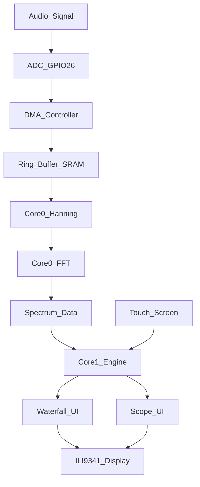

# Layer 1: Signal Capture & Spectral Visualization (Technical Specification)

Этот документ описывает архитектуру и принципы работы **Layer 1** (Уровня захвата и визуализации) автономного радиотерминала на базе RP2350.

## 2. Подсистема захвата (ADC & DMA)

Для обеспечения "стабильности fldigi" захват звука полностью отделен от выполнения программного кода:
*   **ADC (АЦП):** Настроен на GPIO 26 (ADC0). Частота дискретизации — **10 000 Гц** (SAMPLE_RATE).
*   **DMA (Direct Memory Access):** Используется аппаратный контроллер DMA в режиме **Ring Buffer (Кольцевой буфер)**. 
*   **Механика:** DMA забирает данные из регистра АЦП и пишет их в память (SRAM) по кругу. Размер буфера — **2048 выборок** (4096 байт). Благодаря выравниванию адреса (`__attribute__((aligned(4096)))`), переключение указателя с конца в начало буфера происходит аппаратно за 0 тактов процессора.
*   **Результат:** Процессор никогда не ждет готовности данных и не тратит время на их копирование. Данные всегда актуальны.

## 3. Обработка сигналов (DSP на Core 0)

На этом этапе задействуется аппаратный блок **FPU (Floating Point Unit)** ядра Cortex-M33:
1.  **Windowing (Оконная функция):** Перед FFT блок данных (1024 сэмпла) умножается на **окно Ханнинга (Hanning)**. Это предотвращает "растекание" спектра и позволяет четко видеть узкие пики RTTY/CW.
2.  **Fast FFT (БПФ):** Реализован алгоритм Radix-2, оптимизированный под 32-битные числа с плавающей точкой.
3.  **Нормализация:** Значение АЦП (0-4095) приводится к диапазону (-1.0 ... 1.0) относительно центра 1.65V (2048), что соответствует спецификации **Layer 0**.

## 4. Визуализация и UI (Core 1)

Ядро Core 1 отвечает за отрисовку и интерактив, используя **DMA SPI** для максимальной скорости (62.5 МГц).

### 4.1. Spectrum Scope (Панорама)
*   Отображает текущую мощность сигнала по частотам (верхняя зона экрана).
*   **Оптимизация:** Используется метод дифференциальной отрисовки (стирается только старый пиксель и рисуется новый), что позволяет обновлять график 50 раз в секунду без мерцания.
*   **Маркеры:** На панораме отрисовываются цветовые метки текущей настройки (Красная — Mark, Синяя — Space).

### 4.2. Phosphor Waterfall (Водопад)
*   **Phosphor Effect (Накопление):** Реализован алгоритм экспоненциального затухания. Каждое новое значение смешивается со старым: `pixel = (old * 0.85) + (new * 0.15)`. Это создает эффект "мягкого" свечения и позволяет глазу видеть структуру сигнала в шумах.
*   **Palette (Палитра):** Динамическая тепловая палитра (Черный -> Синий -> Голубой -> Зеленый -> Желтый -> Красный).

### 4.3. Touch-to-Tune (Тачскрин)
*   Контроллер **XPT2046** опрашивается по SPI.
*   Координата нажатия по X математически преобразуется в частоту настройки:
    `Freq = Bin_Offset + (Touch_X * Bin_Resolution)`.
*   При нажатии система мгновенно перестраивает цифровые фильтры декодера на выбранную частоту.

## 5. Распределение ресурсов RP2350 (250 MHz)

| Модуль | Ресурс | Нагрузка (оценка) |
| :--- | :--- | :--- |
| FFT (1024 pts) | Core 0 (FPU) | ~5% |
| Waterfall (Phosphor) | Core 1 | ~12% |
| SPI Transfer (DMA) | System Bus | ~8% |
| **ИТОГО** | **Общая** | **~25%** |

*Запас в 75% мощности оставлен для Phase 2 (Декодирование) и Phase 5 (Широкополосный CW Skimmer).*
